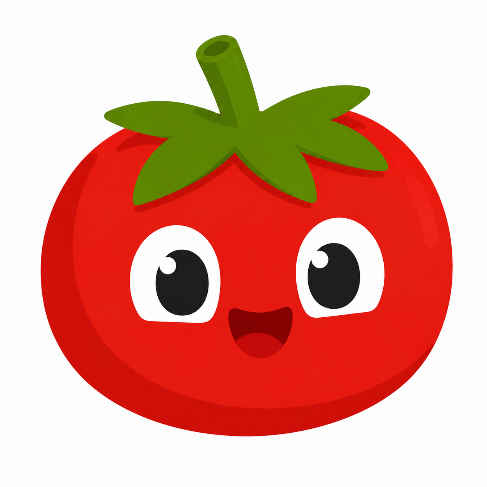
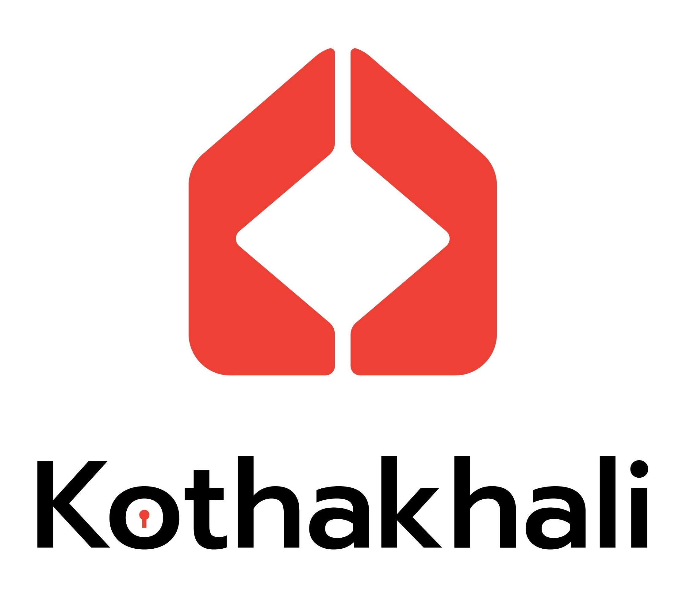

<!-- ============================================================ -->
<!--  BANNER                                                       -->
<!-- ============================================================ -->

<p align="center">
  <!-- ADD YOUR BANNER IMAGE HERE (replace this line with an  tag pointing to your banner file) -->
</p>

<br/>

<!-- ============================================================ -->
<!--  ANIMATED TAGLINE                                            -->
<!-- ============================================================ -->

<p align="center">
  
</p>

<p align="center">
  <a href="mailto:Rajeev.Shrestha@usm.edu"></a>
  <a href="https://linkedin.com/in/shrestharajeev" target="_blank"></a>
  <a href="https://github.com/eclipsu" target="_blank"></a>
  
</p>

<br/>

##  &nbsp;About me

```ts
const rajeev = {
  role:      "CS student, Backend Engineer",
  based_in:  "Hattiesburg, MS",
  school:    "University of Southern Mississippi, CO'2029",
  stack:     ["NestJS", "TypeScript", "PostgreSQL", "Redis", "Next.js", "Docker", "Python"],
  shipping:  "Pomopal, pomopal.lol (30 users, 319 sessions, 121+ focus hrs)",
  mantra:    "Ship it, measure it, fix it."
};
```

I build products: schema, backend, frontend, and deployment. I care about systems that actually run in production, not just on localhost.

- **Full-stack ownership**: from PostgreSQL schema design to deployed Docker containers
- **Data-driven**: I like shipping things I can measure (real users, real sessions, real numbers)
- **AI-integrated systems**: using LLM APIs and ML models as one piece of a larger production pipeline, not the whole product
- Currently building **[Pomopal](https://pomopal.lol)**, a full-stack study-habit app

<br/>

## Tech I work with

<p>
  
  
  
  
  
</p>

<p>
  
  
  
  
  
</p>

<p>
  
  
  
  
  
  
</p>

<p>
  
  
  
  
</p>

<br/>

## Featured projects

<!-- ============================================================ -->
<!--  HERO PROJECT: POMOPAL                                       -->
<!-- ============================================================ -->

<table width="100%" style="border:1px solid #30363d;border-collapse:collapse;">
  <tr>
    <td width="32%" align="center" valign="middle" style="border:1px solid #30363d;padding:12px;">
      <a href="https://pomopal.lol" target="_blank">
        
      </a>
    </td>
    <td width="68%" valign="top" style="border:1px solid #30363d;padding:12px;">
      <h3>Pomopal, Study Habit App</h3>
      <p>
        <strong>Live product for building focus habits.</strong>
        Pomodoro timer with streak tracking, real-time friend presence,
        leaderboards, and automated lifecycle notifications, built and
        deployed solo, end to end.
      </p>
      <p>
        <strong>Metrics:</strong>
        
        
        
      </p>
      <p>
        <strong>Highlights</strong>
      </p>
      <ul>
        <li>Shipped a production study-habit app to real users on a Next.js + NestJS stack</li>
        <li>Built automated retention messaging, 744 lifecycle notifications sent without manual intervention</li>
        <li>Timezone-aware streak logic in PostgreSQL to sustain multi-day habits</li>
        <li>30-second server heartbeats with client-side recovery to prevent lost study progress on interrupted sessions</li>
        <li>Real-time friend presence and leaderboards via Socket.IO + Redis</li>
      </ul>
      <p>
        
        
        
        
        
        
        
      </p>
      <p>
        <a href="https://pomopal.lol" target="_blank"></a>
      </p>
    </td>
  </tr>
</table>

<br/>

<!-- ============================================================ -->
<!--  PROJECTS ROW: KOTHAKHALI + NEETCODESRS                      -->
<!-- ============================================================ -->

<table width="100%" style="border:1px solid #30363d;border-collapse:collapse;">
  <tr>
    <td width="50%" valign="top" style="border:1px solid #30363d;padding:12px;">
      <a href="#" target="_blank">
        
      </a>
      <h3>Kothakhali</h3>
      <p>
        A rental marketplace for Kathmandu connecting room seekers and landlords.
        Hybrid PostgreSQL full-text search, ML-based photo moderation, and a
        web-scraped seed dataset of real listings.
      </p>
      <ul>
        <li>Hybrid <code>tsvector</code> + <code>ts_rank</code> + ILIKE search across 5 location fields for locality-based discovery</li>
        <li>NSFW image moderation gate (TensorFlow.js + NSFWJS) rejecting flagged uploads before storage</li>
        <li>Web scraping pipeline seeding the MVP with 1,300+ real listings from Hamrobazaar</li>
        <li>Redis caching with versioned keys to cut repeated DB hits on search/detail pages</li>
      </ul>
      <p>
        
        
        
        
        
      </p>
    </td>
    <td width="50%" valign="top" style="border:1px solid #30363d;padding:12px;">
      <a href="https://github.com/eclipsu/NeetcodeSRS" target="_blank">
        <p align="center">
          
          
        </p>
      </a>
      <h3>NeetcodeSRS</h3>
      <p>
        Chrome extension for coding-interview practice with
        <a href="https://github.com/open-spaced-repetition/ts-fsrs" target="_blank">FSRS</a>
        spaced repetition. Rate problems right after you get
        <strong>Accepted</strong> on NeetCode or LeetCode — reviews are scheduled for you.
      </p>
      <p>
        <strong>Highlights</strong>
      </p>
      <ul>
        <li>Post-Accepted rating prompt on <strong>NeetCode</strong> and <strong>LeetCode</strong> (Submit / Ctrl+Enter)</li>
        <li>Daily review queue with Again / Hard / Good / Easy + streaks and stats</li>
        <li>Optional private sync via your own GitHub Gist</li>
        <li>Install from GitHub Releases zip (Load unpacked) — see the repo README</li>
      </ul>
      <p>
        
        
        
        
        
      </p>
      <p>
        <a href="https://github.com/eclipsu/NeetcodeSRS" target="_blank"></a>
        <a href="https://github.com/eclipsu/NeetcodeSRS/releases" target="_blank"></a>
      </p>
    </td>
  </tr>
</table>

<br/>

<p align="center">
  <a href="https://github.com/eclipsu?tab=repositories" target="_blank">
    
  </a>
</p>

<br/>

## GitHub stats

<p align="center">
  
  
</p>

<p align="center">
  <a href="https://git.io/streak-stats">
    
  </a>
</p>

<p align="center">
  
</p>

<br/>

## Let's connect

<p align="center">
  Building something, hiring, or just want to talk backend systems?<br/>
  <em>Always down to chat about databases, distributed systems, or shipping fast.</em>
</p>

<p align="center">
  <a href="mailto:Rajeev.Shrestha@usm.edu">
    
  </a>
  <a href="https://linkedin.com/in/shrestharajeev" target="_blank">
    
  </a>
  <a href="https://github.com/eclipsu" target="_blank">
    
  </a>
</p>

<br/>

<p align="center">
  <em>"Ship it, measure it, fix it."</em>
</p>

<p align="center">
  
</p>
